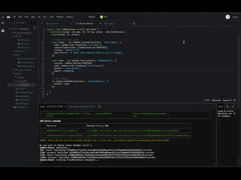

# Requirements:
- AWS CDK
```npm install -g aws-cdk```
- Node.js - [Download Link](https://nodejs.org/en/download/)
- An AWS account
- Local credentials ( unless using Cloud 9 )
- jq [Download Link](https://stedolan.github.io/jq/) ( not required but very useful )

# Overview

This is an example project showing:
- AWS CDK
- TypeScript
- Deploying a new layer in a CDK project and deploy a function that will use the layer.

# Intro
I have been following Deno for a little while, it's nice to use strong typing in JavaScript however the transpilers are a slight overhead. Deno does away with this and allows the use of TypeScript without compilation.

The CDK stack project is still using TypeScript that is compiled however you can see in ```tsconfig.json``` that /src/program is excluded meaning we dont need to compile test files.

# Stack
The stack consists of:
- Lambda layer that enables Deno runtime
- A Lambda function
- An API gateway

To start off clone the repo and cd into the folder then run:

```console
npm install
npm run watch
```

This will start monitoring the CDK stack TypScript files and compile them to vanilla JavaScript.  Keep an eye on the terminal as it will compile the stack code as you make changes and save, and you'll be able to spot mistakes pre runtime.

# Layers in CDK
How do we define a layer in CDK?  I decided not to build the runtime in this example but show how to deploy a built runtime.  I took the latest release from:
[https://github.com/hayd/deno-lambda/releases](https://github.com/hayd/deno-lambda/releases
) and unzipped the contents into src/layer folder.  These file are what is required to run Demo.  In CDK we define a new layer:

```js
const layer = new lambda.LayerVersion(this, 'deno-layer', {
    code: lambda.Code.fromAsset('src/layer'),
    compatibleRuntimes: [lambda.Runtime.PROVIDED],
    license: 'Apache-2.0',
    description: 'A layer that enables Deno to run in AWS Lambda',
});
```

# Lambda function:
We can see that AWS provide the `lambda.Runtime.PROVIDED` value for use when we are leveraging a custom runtime.
The code will come from `src/program` folder, in this case a single file called `name.ts` this file is directly deployed as a TypeScript file.  When we create the function we pass in the layer defined above ( that value will be the ARN of the layer ).  The handler is the name of the file ( eg name )

```js
const name = new lambda.Function(this, 'NameHandler', {
      runtime: lambda.Runtime.PROVIDED,
      code: lambda.Code.fromAsset('src/program'),
      handler: 'name.handler',
      layers: layer,
    })
```

# API Gateway

```js
// API Gateway
new apigw.LambdaRestApi(this, 'Endpoint', {
  handler: name
});
```

# Sample App:
The sample program is very simple, using the good old Object Oriented "Person" example we create a  person, it shows private variables, and the use of a getter and a constructor.

### deps.ts
```js
import * as bcrypt from "https://deno.land/x/bcrypt/mod.ts";

export { bcrypt };

export {
  APIGatewayProxyEvent,
  APIGatewayProxyResult,
  Context,
} from "https://deno.land/x/lambda/mod.ts";

export { v4 } from "https://deno.land/std/uuid/mod.ts";

```

### app.ts
```js
import {
  APIGatewayProxyEvent,
  APIGatewayProxyResult,
  Context,
  v4,
  bcrypt,
} from "./deps.ts";

class Person {
  private _fullName: string;

  constructor(firstName: string) {
    this._fullName = firstName;
  }

  fullName(): string {
    return this._fullName + "!";
  }
}

class Result {
  uuid: string;
  key: string;
  user: Person;
  message: string;

  constructor(uuid: string, key: string, user: Person, message: string) {
    this.uuid = uuid;
    this.key = key;
    this.user = user;
    this.message = message;
  }
}

const constructResponse = async (event: APIGatewayProxyEvent) => {
  // const name = event.path.replace("/", "");
  const name = "sam.leung";
  const uuid = v4.generate();
  const user = new Person(name);

  const salt = await bcrypt.genSalt(8);
  const key = await bcrypt.hash(uuid, salt);

  const result = new Result(
    uuid,
    key,
    user,
    `Hi ${user.fullName()}, Welcome to deno ${Deno.version.deno} 🦕`
  );

  return result;
};

const handler = async (
  event: APIGatewayProxyEvent,
  context: Context
): Promise<APIGatewayProxyResult> => {
  const body = await constructResponse(event);

  return {
    statusCode: 200,
    headers: { "Content-Type": "text/json" },
    body: JSON.stringify(body),
  };
};

export { handler };

```

# Deploy
When you are ready to deploy, run ```cdk bootstrap``` then ```cdk deploy```

Outputs will look like:
```
 ✅  DenoCdkStack

Outputs:
CdkOneStack.Endpoint8024A810 = https://your-url/prod/
```

CdkOneStack is defined in:```/bin/deno-cdk.ts``` you can change the name of the stack if you desire:

```#!/usr/bin/env node
import * as cdk from '@aws-cdk/core';
import { DenoCdkStack } from "../lib/deno-cdk-stack";

const app = new cdk.App();
new DenoCdkStack(app, "DenoCdkStack");  // <- Stack name>
```

# Call your function!
You can call this by issuing the command:
```console
curl -X GET -H "Content-Type: application/json" -H 'x-api-key: ${API-KEY}' https://${your-url}/${stage}/${source-path}
```

```console
{
  "message": "Hi Your-Name-Here!, Welcome to deno 1.1.0 🦕",
  "user": {
    "_fullName": "Your-Name-Here"
  }
}

```

# Video
[](https://www.youtube.com/watch?v=qgxB8CYYqxE)


The `cdk.json` file tells the CDK Toolkit how to execute your app.

## Useful commands

 * `npm run build`   compile typescript to js
 * `npm run watch`   watch for changes and compile
 * `cdk deploy`      deploy this stack to your default AWS account/region
 * `cdk diff`        compare deployed stack with current state
 * `cdk synth`       emits the synthesized CloudFormation template
